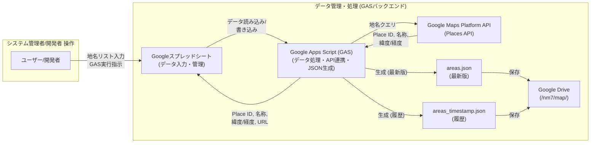
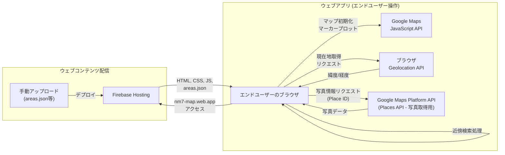

PlaceIdや緯度経度を取得して、GoogleMap上に表示するSample  
areas.jsonはFirebase Hostigin上に公開されています。  
水樹奈々さんの聖地巡礼マップを使いたい人は、使ってみてください！（不定期更新） 
https://nm7-map.web.app/areas.json  

## 緯度経度情報を取得するためのスクリプトの図示



## フロントの仕組み



## License
```
========================================================================
                           NM7 Software License
                                  (MN License)
                                 Version 1.0
========================================================================

Copyright (c) 2025 Yuhei Ueno

This software and associated documentation files (the "Software") may be used,
copied, modified, merged, published, and distributed free of charge for
academic and research purposes, under the following conditions:

Article 1 – No Warranty
THE SOFTWARE IS PROVIDED "AS IS", WITHOUT WARRANTY OF ANY KIND, EXPRESS OR
IMPLIED, INCLUDING BUT NOT LIMITED TO THE WARRANTIES OF MERCHANTABILITY,
FITNESS FOR A PARTICULAR PURPOSE, AND NON-INFRINGEMENT. IN NO EVENT SHALL THE
AUTHOR BE LIABLE FOR ANY CLAIM, DAMAGES, OR OTHER LIABILITY.

Article 2 – Mizuki Nana Clause (Special Condition)
If you use this Software and happen to meet the Author in person, and both
parties have time, it is kindly requested that you engage in a cheerful
conversation about Mizuki Nana—her music, concerts, voice acting, or any other
topic related to her artistry.
*Note: This clause is not legally binding, but is sincerely desired by the Author.*

Notes on Usage
- ✅ Use in research or academic settings → Allowed
- ✅ Modify and share                   → Allowed
- ❌ Use in commercial products         → Not allowed (please contact the Author if necessary)

========================================================================
                        NM7ソフトウェアライセンス
                               （MNライセンス）
                                バージョン 1.0
========================================================================

Copyright (c) 2025 Yuhei Ueno

本ソフトウェアおよび関連ドキュメントファイル（以下「本ソフトウェア」）は、
研究目的および学術的な利用において、無償で使用、複製、改変、統合、公開、
配布することを許可します。ただし、以下の条件を満たす必要があります：

第1条（無保証）
本ソフトウェアは「現状のまま」提供されており、いかなる明示的または黙示的な
保証も行いません。特定目的への適合性、商品性、第三者の権利非侵害性などの
保証を含みますが、これに限定されません。いかなる損害や請求についても、
著作権者は一切の責任を負いません。

第2条（特別条項：水樹奈々条項）
本ソフトウェアを利用された方が、もし著作権者と直接お会いする機会があり、
かつ双方に時間的余裕がある場合は、ぜひ**水樹奈々さんについて語り合ってください**。
音楽、ライブ、演技、歴史、あらゆる面について、楽しくお話できれば幸いです。  
※この条項は法的義務ではありませんが、著作権者の強い希望です。

使用に関する補足
- ✅ 研究・学術用途 → OK
- ✅ 改変して共有   → OK
- ❌ 商用利用       → 原則禁止（どうしても使いたい場合は相談してね）
```
